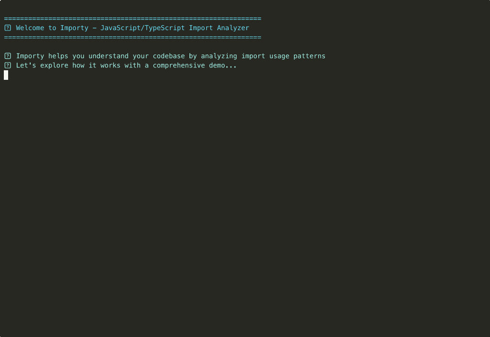

# Importy Demo 🎬

Welcome to the interactive demo of **Importy** - the powerful CLI tool for analyzing JavaScript/TypeScript imports!

## 🎥 Live Demo



*Watch Importy in action as it analyzes a real React project with multiple libraries*

## 🚀 What You'll See

This demo showcases Importy's key features using a realistic demo project with:

### 📂 Demo Project Structure
- **React Components** with hooks (useState, useEffect, useCallback, etc.)
- **Lodash Utilities** for data manipulation
- **Date-fns Functions** for date formatting
- **Axios** for HTTP requests
- **TypeScript** files with complex import patterns

### 🔍 Features Demonstrated

1. **Basic Import Analysis**
   ```bash
   importy --dir demo-project/src --lib react
   ```
   - Discovers all React imports across the codebase
   - Shows usage statistics and file locations

2. **Verbose Output**
   ```bash
   importy --dir demo-project/src --lib lodash --verbose
   ```
   - Displays processing progress
   - Shows concurrent file processing
   - Provides detailed timing information

3. **JSON Export**
   ```bash
   importy --dir demo-project/src --lib react --output results.json
   ```
   - Saves structured analysis results
   - Perfect for automation and CI/CD integration

4. **File Filtering**
   ```bash
   importy --dir demo-project/src --lib date-fns --include "**/*.ts"
   ```
   - Include/exclude specific file patterns
   - Focus analysis on relevant code

5. **Performance Control**
   ```bash
   importy --dir demo-project/src --lib react --concurrency 2
   ```
   - Adjustable concurrency for optimal performance
   - Works efficiently on any system

6. **Multi-Library Analysis**
   - Compare usage across different libraries
   - Perfect for dependency auditing
   - Helps with migration planning

## 📊 Real Results

The demo shows actual analysis results including:

- **React**: 9 components, 15 total imports across 5 files
- **Lodash**: 9 utilities, 13 total imports across 2 files  
- **Date-fns**: 3 functions, 3 total imports in 1 file
- **Axios**: 1 import, 1 total usage

## 🎯 Use Cases Highlighted

### 🔧 Dependency Auditing
Quickly identify which parts of large libraries you're actually using:
```json
{
  "summary": {
    "library": "lodash",
    "componentsFound": 9,
    "totalImports": 13,
    "filesScanned": 5
  },
  "components": {
    "debounce": ["src/utils/helpers.ts", "src/index.ts"],
    "throttle": ["src/utils/helpers.ts", "src/index.ts"],
    "pick": ["src/utils/helpers.ts", "src/index.ts"]
  }
}
```

### 📈 Migration Planning
See exactly which React hooks are used where:
- `useState` → 3 files
- `useEffect` → 2 files  
- `useCallback` → 1 file
- `useMemo` → 1 file

Perfect for planning class component → hooks migrations!

### 🎨 Bundle Optimization
Identify unused imports and optimize your bundle size by switching to targeted imports.

## 🛠️ Try It Yourself

### Quick Start
```bash
# Install globally
npm install -g importy

# Analyze your React project
importy --dir ./src --lib react

# Check lodash usage
importy --dir ./src --lib lodash --verbose

# Export results for further analysis
importy --dir ./src --lib @mui/material --output mui-analysis.json
```

### Advanced Usage
```bash
# Focus on TypeScript files only
importy --dir ./src --lib axios --include "**/*.ts"

# Exclude test files
importy --dir ./src --lib react --exclude "**/*.test.{ts,tsx}"

# Performance optimization
importy --dir ./src --lib lodash --concurrency 4 --verbose
```

## 📁 Demo Files

The demo uses a realistic project structure:

```
demo-project/
├── src/
│   ├── App.tsx                 # Main React component with hooks
│   ├── index.ts               # Entry point with multiple imports
│   ├── components/
│   │   ├── Dashboard.tsx      # Complex component with context
│   │   └── UserCard.tsx       # Memo component with interactions
│   └── utils/
│       └── helpers.ts         # Utility functions with lodash
```

Each file contains realistic import patterns you'd find in production applications.

## 🎬 Technical Details

### Recording Specifications
- **Terminal Size**: 120 columns × 35 rows
- **Theme**: Dracula color scheme
- **Font Size**: 14px for optimal readability
- **Speed**: 1.5x playback for smooth viewing
- **Duration**: ~3 minutes comprehensive demo

### File Formats Available
- `improved-demo.gif` - Full quality demo (1.5MB)
- `improved-demo-small.gif` - Optimized version (1.2MB)
- `improved-demo.cast` - Original asciinema recording

## 🌟 Key Takeaways

After watching this demo, you'll understand how Importy can:

✅ **Accelerate Code Reviews** - Quickly see what's imported from where  
✅ **Optimize Dependencies** - Identify unused library features  
✅ **Plan Migrations** - Map out refactoring strategies  
✅ **Automate Audits** - Integrate into CI/CD pipelines  
✅ **Improve Performance** - Find opportunities for tree-shaking  

## 🚀 Get Started Today

Ready to analyze your own codebase? 

```bash
npm install -g importy
importy --help
```

For more examples and documentation, visit:
- 📖 [README.md](README.md) - Complete documentation
- 🛠️ [CONTRIBUTING.md](CONTRIBUTING.md) - Development guide
- 🔒 [SECURITY.md](SECURITY.md) - Security policies
- 📝 [CHANGELOG.md](CHANGELOG.md) - Version history

---

*Happy analyzing! 🔍✨*